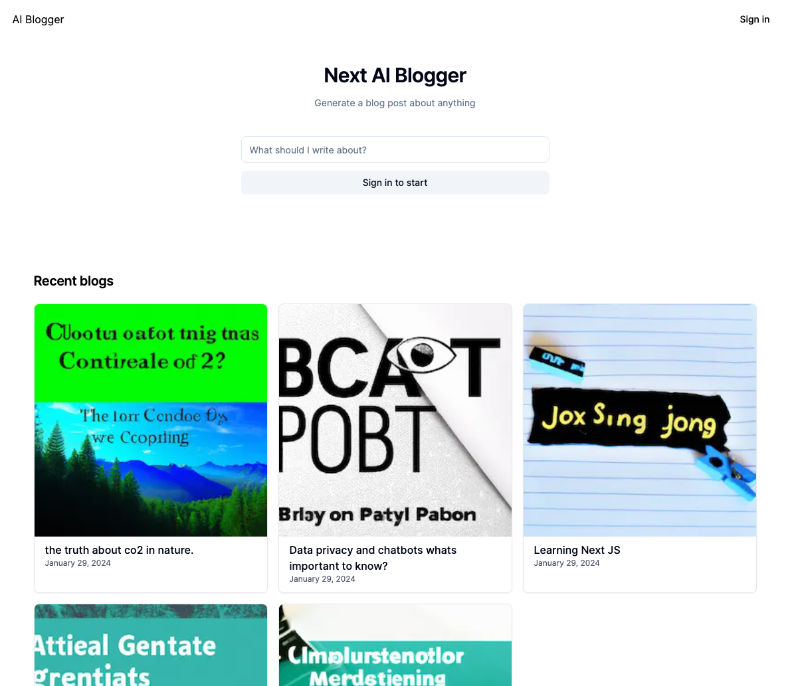
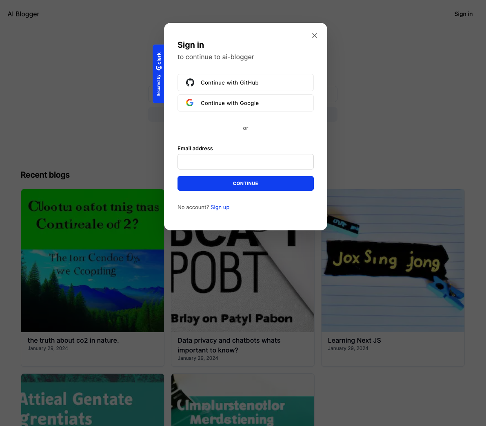
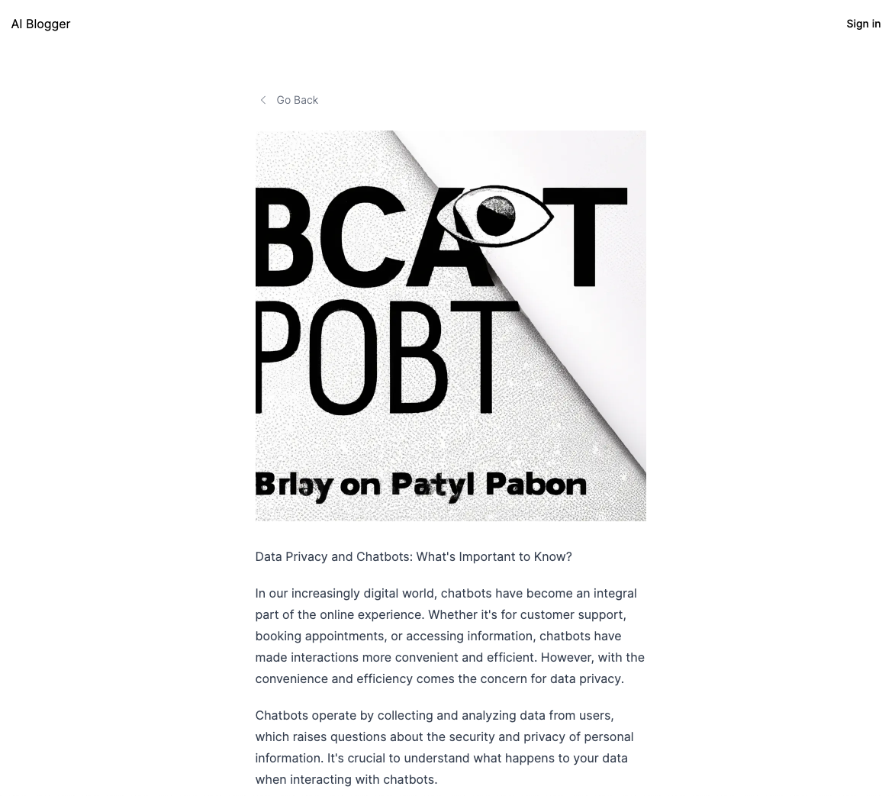

# Next AI Blogger

We're going to build an AI blog generator powered by OpenAI's GPT-4 and DALL·E 3 or models, Supabase backend for database and storage, NextJs 14 for our frontend application, and Clerk for authentication and user management.

In this case, DALL-E-3 might be a more resource-intensive version of the model, which means it requires more computational power to generate images compared to DALL-E-2. As a result, the free tier of ChatGPT might not have sufficient resources to support DALL-E-3. Therefore, you had to switch to DALL-E-2, which likely has lower resource requirements and is available within the limitations of the free tier. That was the reason why the current implementation of the AI Blogger uses DALL-E-2 and the generated images are not as good as the ones generated by DALL-E-3.



## Architecture

We'll start by creating a fullstack app using NextJs 14 and Supabase. We'll then add authentication using Clerk to protect our endpoints, and lastly, we'll add an API Gateway to proxy our backend and expose our API to other developers with API key authentication and rate limiting.

## Backend

### Supabase

We're going to use supabase to store our blog posts and images. Supabase is an open source Firebase alternative. It provides database, authentication, storage, and serverless functions. It's built on top of PostgreSQL and provides a nice UI for managing your database.

## Frontend

### NextJs

We're going to use NextJs 14 to build our frontend application and use server actions to handle form submission and API calls. We're going to learn about the App router, caching, server actions, and adding loading UI to our forms.

### Clerk

We're going to use Clerk to add authentication to our application. Clerk is a complete suite of embeddable UIs, flexible APIs, and admin dashboards to authenticate and manage your users.

## Getting Started

First, run the development server:

```bash
npm run dev
# or
yarn dev
# or
pnpm dev
# or
bun dev
```

Open [http://localhost:3000](http://localhost:3000) with your browser to see the result.

## Deploy on Vercel

The easiest way to deploy your Next.js app is to use the [Vercel Platform](https://vercel.com/new?utm_medium=default-template&filter=next.js&utm_source=create-next-app&utm_campaign=create-next-app-readme) from the creators of Next.js.

Check out our [Next.js deployment documentation](https://nextjs.org/docs/deployment) for more details.
